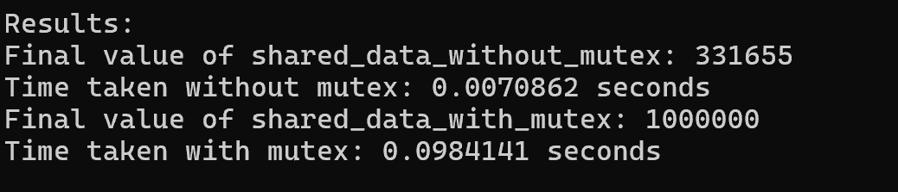

**Практика 3 (`BPC`)**:
   В этом проекте мы используем многопоточность с примененнием общей переменной, защищая запись в общую переменную, в одном случае и ,не защищая в другом. Без защиты мьютексом потоки могут пытаться обращаться к ней и записывать в нее одновременно, что приведет к гонке данных и неверному значению.
   
   

