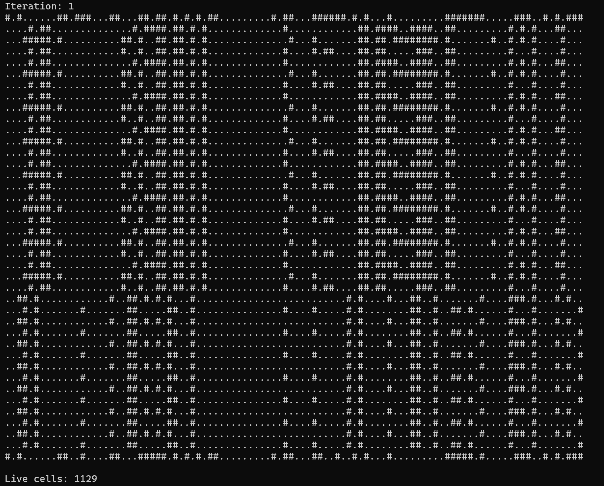
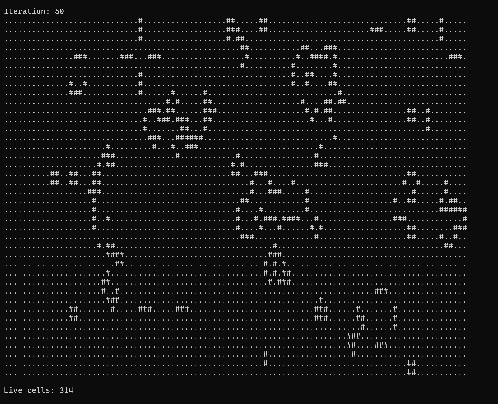

**Практика (`BPC-8`)**:
   Тут мы реализуем игру "Жизнь", в которой есть мертвые и живые клетки, умирающие и рождающиеся согласно правилам. Задача вывести в консоль матрицу состояния клеток на текущей итерации, а также посчитать число живых клеток в паралельных процессах openmp.
   Вид рандомно инициализированной матрицы на 1 итерации:
   
   Вид на 50 итерации:
   
   

